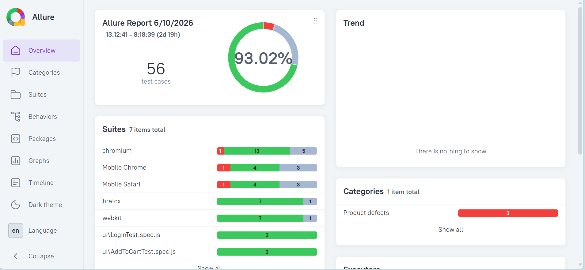
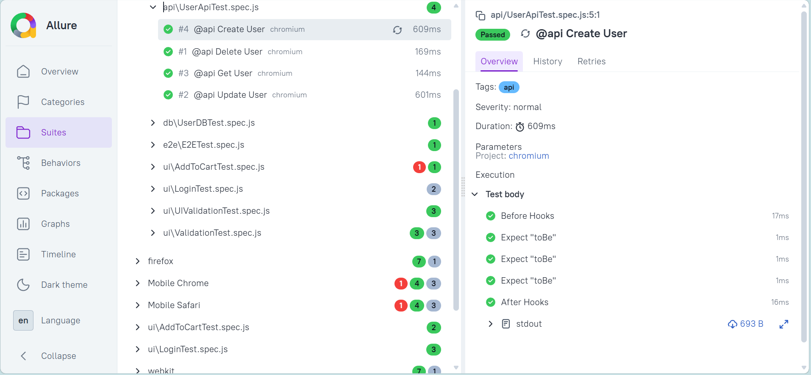
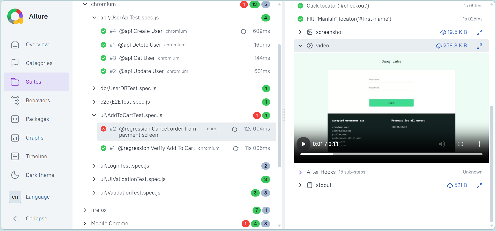

# PlayForge: Playwright E2E Automation Framework

A scalable End-to-End Test Automation Framework built using Playwright, JavaScript, API Testing, Database Validation, Jenkins CI/CD, and Allure Reporting.

## Project Overview

This framework demonstrates enterprise-level automation practices by combining:

- UI Automation Testing
- API Automation Testing
- Database Validation
- End-to-End Business Flow Validation
- CI/CD Integration
- Advanced Reporting

The framework follows industry-standard design patterns including:

- Page Object Model (POM)
- Service Object Model
- Repository Pattern

---

## Tech Stack

| Technology | Usage |
|------------|--------|
| Playwright | UI Automation |
| JavaScript | Programming Language |
| Axios | API Automation |
| MySQL | Database Validation |
| Allure Report | Reporting |
| Jenkins | CI/CD |
| Winston | Logging |
| Dotenv | Environment Management |
| Git | Version Control |

---

## Framework Architecture

```text
playwright-e2e-framework
│
├── api
│   ├── ApiClient.js
│   └── UserApi.js
│
├── database
│   ├── DBConnection.js
│   ├── UserRepository.js
│   └── CustomerRepository.js
│
├── fixtures
│
├── pages
│   ├── BasePage.js
│   ├── LoginPage.js
│   ├── InventoryPage.js
│   ├── CartPage.js
│   └── CheckoutPage.js
│
├── testdata
│
├── tests
│   ├── api
│   ├── ui
│   ├── database
│   └── e2e
│
├── utils
│   ├── Logger.js
│   ├── ConfigReader.js
│   ├── CustomerGenerator.js
│   └── CustomerValidator.js
│
├── reports
│
└── playwright.config.js
```

---

## Features

### UI Automation

- Login Validation
- Product Validation
- Add To Cart
- Checkout Process
- Order Placement

### API Automation

- Create User
- Get User
- Update User
- Delete User

### Database Validation

- Customer Data Validation
- Data Integrity Verification
- Repository-Based Query Execution

### Reporting

- HTML Reports
- Allure Reports
- Screenshots on Failure
- Video Recording on Failure
- Execution Logs

### CI/CD

- Jenkins Integration
- Automated Regression Execution
- Report Publishing

---

## Design Patterns Used

### Page Object Model

```text
Tests
 ↓
Pages
 ↓
Playwright Actions
```

### Service Object Model

```text
Tests
 ↓
API Services
 ↓
Axios Client
```

### Repository Pattern

```text
Tests
 ↓
Repositories
 ↓
Database
```

---

## Environment Configuration

Create `.env`

```env
BASE_URL=https://www.saucedemo.com

API_URL=https://reqres.in/api

DB_HOST=localhost
DB_USER=root
DB_PASSWORD=root
DB_NAME=automation_db
```

---

## Installation

Clone Repository

```bash
git clone <repository-url>
```

Install Dependencies

```bash
npm install
```

Install Browsers

```bash
npx playwright install
```

---

## Execute Tests

Run All Tests

```bash
npx playwright test
```

Run Smoke Tests

```bash
npm run smoke
```

Run Regression Tests

```bash
npm run regression
```

Run API Tests

```bash
npx playwright test tests/api
```

Run Database Tests

```bash
npx playwright test tests/database
```

Run E2E Tests

```bash
npx playwright test tests/e2e
```

---

## Allure Reporting

Generate Report

```bash
allure generate ./allure-results --clean
```

Open Report

```bash
allure open
```

---

# Reporting Screenshots

## Allure Dashboard



---

## Test Suites View



---

## Video Recording On Failure

Playwright automatically records execution videos for failed test cases.



---

## Sample E2E Flow

```text
Create Customer
        ↓
Validate Customer Data
        ↓
Insert Customer Into DB
        ↓
Login Application
        ↓
Add Product To Cart
        ↓
Checkout Using Customer Data
        ↓
Validate Order
        ↓
Cleanup Test Data
```

---

## Customer Validation Rules

The framework validates:

### First Name

- Cannot be blank
- Minimum 3 characters
- No special characters

### Last Name

- Cannot be blank
- Minimum 3 characters
- No special characters

### Zip Code

- Cannot be blank
- Minimum 3 digits
- Numeric Validation

---

## Future Enhancements

- Docker Integration
- GitHub Actions
- Parallel Grid Execution
- Slack Notifications
- Extent Reports
- Azure DevOps Integration
- Data Driven Testing
- Cross Browser Execution

---

## Author

**Manish Kumar Sonkar**

Software Engineer | QA Automation Engineer | SDET Aspirant

LinkedIn:
https://linkedin.com/in/mks07manish

GitHub:
https://github.com/mks07manish